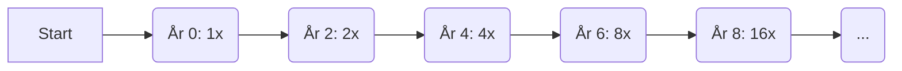
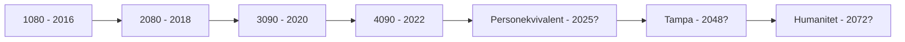

La oss definere ein **Datakraftperson (DKP)** som 20 PFLOPS - omtrent 64 NVIDIA A100 GPU-ar, eller ein tett 42U-rack med A100-ar. Vi er no i æraen av *1-rack-DKP*, som brukar om lag 30 kW for å gi desse 20 PFLOPSa.

> **FLOPS**: Eit mål på ytinga til ein datamaskin - tal på *flytpunktoperasjonar per sekund*.  
> *Ein moderne PC har om lag 50 TFLOPS, eller 1/400 av ein "Datakraftperson".*

LLaMA-språkmodellen vart trena på eit cluster av 2048 A100 GPU-ar, kvar med ~312 TFLOPS. Dette *32-DKP-clusteret* (639 PFLOPS) trena LLaMA i 3 veker - tilsvarande 2 *DKP-år*. Til samanlikning brukte GPT-4 heile *100 DKP-år*!

Datamaskinytinga stig eksponensielt etter **Moore's lov** - ei dobling kvart andre år. Dagens 4090 GPU (82.6 TFLOPS) har over *7x ytinga* til 1080 frå 2016 (11.3 TFLOPS). Kvart steg er som å reise 2 år inn i framtida.

Google sin 9 eksaflops datamaskin (450 DKP) er då 24 år forut for si tid. For å setje dette i perspektiv:

- **Om 24 år** kan vi byggje ein maskin på storleik med heile menneskeslekta (ein Humanitet) for same pris som ISS.
- **Om 44 år** vil framtidas Google ha ein Humanitet.
- **Om 54 år** vil eit vanleg cluster vere ein Humanitet.
- **Om 66 år** har du ein Humanitet under pulten.

Men kor mykje datakraft har eigentleg den menneskelege hjernen? Eit Google-søk fortel oss at:

- Energitilførselen til eit nevron frå ATP under ein aksjonspotensial er 2.468 × 10^−7 J.  
  Dette tyder at om hjernen brukar 20W, er det 81 millionar fyringshendingar per sekund.
- Om kvart nevron har ein fan-out på 1000 (1000 MAC), gir det 2000 FLOPS per nevron - totalt berre 162 GFLOPS.

**Definisjonar:**

- **fan-out**: Talet på utgangar frå eit nevron til andre nevron.  
- **MAC**: Multiply-accumulate operation. Ei grunnleggjande operasjon i nevrale nettverk.

Sjølv om nevron er glisne og kanskje berre brukar 1% 1-tal, er dette framleis berre 16 TFLOPS - langt frå estimatet på 20 PFLOPS for hjernen. Kanskje ein 3090 GPU allereie er ein menneskeleg hjerne?

### Samanheng

Ein meta-arketype i systemtenking som handlar om å sjå mønster og koplingar på tvers av system og nivå.  
Å sjå korleis eksponensiell vekst i datakraft heng saman med framtida for menneskeleg sivilisasjon.

Det er inga enkel løysing på desse spørsmåla, men ved å tenkje systemisk og sjå samanhengar, kan vi kanskje navigere denne ukjende framtida med visdom og medkjensle. For singulariteten kjem, anten vi vil eller ei - spørsmålet er berre korleis vi møter den.
